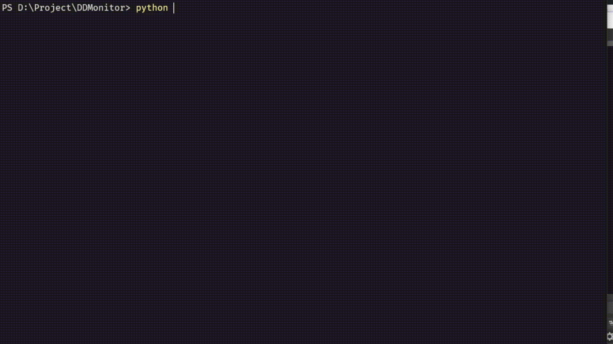

[](https://python.org)  [](https://gitter.im/See-Night/BiliLive?utm_source=badge&utm_medium=badge&utm_campaign=pr-badge)

📕[中文说明](./README.md) | English Readme

**BiliLive** is a Python based [Bilibili Live](https://live.bilibili.com) automatic recording script.

<strong style="color: red;">Warning: </strong>Make sure you have the [Python](https://python.org) environment installed on your device before using it.

## Install

### To get the script

If you have Git on your device, you can use Git to clone the repository directly from Github.

```bash
git clone https://github.com/See-Night/BiliLive.git
```

If you don't know anything about Git and don't want to know, you can directly download script from [here](https://github.com/See-Night/BiliLive/releases/latest).

### Install dependencies

Bilive relies on the `requests` and `colorama` modules.

```bash
pip install -i https://pypi.tuna.tsinghua.edu.cn/simple requests colorama
```

<small>Run the above commands from the command line to automatically install.</small>

## 运行

BiliLive scripts work as pure command lines, and you need to know at least a little bit about **path**s before using them. You can double-click to run it, or you can run it as a command line + argument. The following describes how to run the command line.

```bash
# Go to the directory where bilive is located
cd BiliLive

# Run the script
python BiliLive.py -r <roomid> -o <outdir>
# Or
python BiliLive.py
```

- `roomid` ：Live room ID
- `outdir` ：Video output path

If you add a parameter, the script will listen and record the live stream directly based on the parameter value. If no parameter is added, enter corresponding parameters as prompted.

On Windows, you can theoretically double-click the script file to run it.

**For example**：

```bash
python BiliLive.py -r 12235923 -o "D:\Video"
```

This command tells the script to listen to the `12235923` live broadcast room, record when the live broadcast starts, and save to the `D:\Video` path.

> Do not close the command line while the script is running; otherwise, the script will automatically stop working.



## Docker deployment

For users who have a large number of live broadcast recording needs, batch and automated recording programs are very important. Only a Docker-based deployment scheme is proposed here for reference. You can build a Docker container directly using 'Dockerfile' in the library, Or from [Docker Hub](https://hub.docker.com/repository/docker/seenight/bililive) directly pull I build a good image:

```bash
docker pull seenight/bililive
```

### Single container startup

If you only need to start a single container, you can simply create one.

```bash
docker run --name <container name> -v <local path>:/app/video -d seenight/bililive <room id>
```

- `container name` Container name, just give yourself a name to identify it
- `local path` The video recording path is a local path on the device
- `room id` Live room id

### Multiple container startup

If you need to record multiple broadcast rooms, you are advised to start with a shell script. Before starting the script, you need to create a new `room_list. TXT` file in the directory where the script is located to store the recorded studio information. The contents are as follows:

```
<room_id> <name>
```

- `room_id` Live room id
- `name` name; The name here is used to distinguish different broadcasting rooms, and will also be used for the name of Docker container

For example:

```
6 LOL
22384516 umy
```

After creating `room_list.txt`, execute the `auto.sh` script to start and close live recording:

```bash
# Give the script permission to run
chmod u+x auto.sh

# Start the recording
./auto.sh start <local path>

# Close to record
./auto.sh stop
```

* `local path` Path for storing recorded videos

If you want to turn off recording for a live studio separately, close the Docker container separately.

## FAQ

If you encounter any problems, please go to [Gitter](https://gitter.im/See-Night/BiliLive? Utm_source = share-link&UTM _medium= link&UTM _campaign=share-link).

## LINCENSE

```
MIT License

Copyright (c) 2021 See-Night

Permission is hereby granted, free of charge, to any person obtaining a copy
of this software and associated documentation files (the "Software"), to deal
in the Software without restriction, including without limitation the rights
to use, copy, modify, merge, publish, distribute, sublicense, and/or sell
copies of the Software, and to permit persons to whom the Software is
furnished to do so, subject to the following conditions:

The above copyright notice and this permission notice shall be included in all
copies or substantial portions of the Software.

THE SOFTWARE IS PROVIDED "AS IS", WITHOUT WARRANTY OF ANY KIND, EXPRESS OR
IMPLIED, INCLUDING BUT NOT LIMITED TO THE WARRANTIES OF MERCHANTABILITY,
FITNESS FOR A PARTICULAR PURPOSE AND NONINFRINGEMENT. IN NO EVENT SHALL THE
AUTHORS OR COPYRIGHT HOLDERS BE LIABLE FOR ANY CLAIM, DAMAGES OR OTHER
LIABILITY, WHETHER IN AN ACTION OF CONTRACT, TORT OR OTHERWISE, ARISING FROM,
OUT OF OR IN CONNECTION WITH THE SOFTWARE OR THE USE OR OTHER DEALINGS IN THE
SOFTWARE.
```

## Thanks

Thank [lovelyyoshino](https://github.com/lovelyyoshino) and [fython](https://github.com/fython), and others to sort out and summarize the B stand API, saves me a lot of development work.